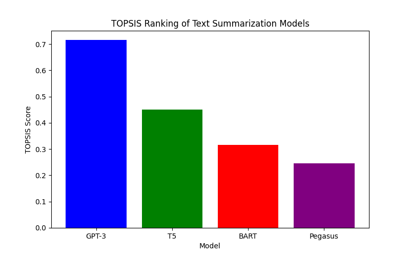

# TOPSIS Ranking of Text Summarization Models

## Overview

In this project, we applied the **TOPSIS** (Technique for Order Preference by Similarity to Ideal Solution) method to rank four different pre-trained models for text summarization based on three criteria: **ROUGE Score**, **Inference Time**, and **Model Size**. The goal was to determine the best model considering these criteria, where a higher ROUGE score is preferable, while lower Inference Time and Model Size are desired.

## Models Considered

The following four text summarization models were evaluated:

- **BART**: A transformer model for text generation tasks like summarization.
- **T5**: A text-to-text transformer model, suitable for various natural language processing tasks.
- **GPT-3**: A large-scale transformer model for generating human-like text.
- **Pegasus**: A model specialized in abstractive text summarization.

## Criteria for Evaluation

- **ROUGE Score**: Higher ROUGE scores are preferred as they reflect better summary quality.
- **Inference Time**: Shorter inference times are preferable for faster processing.
- **Model Size**: Smaller model sizes are better for efficient deployment and resource utilization.

## Data Used

The following sample data was used for evaluating the models:

| Model     | ROUGE Score | Inference Time (seconds) | Model Size (MB) |
|-----------|-------------|--------------------------|-----------------|
| BART      | 0.85        | 1.2                      | 500             |
| T5        | 0.88        | 1.5                      | 420             |
| GPT-3     | 0.92        | 2.0                      | 340             |
| Pegasus   | 0.89        | 1.1                      | 460             |

## Methodology

1. **Normalization**: The data was normalized to make it comparable by dividing each criterion by the square root of the sum of squares for that criterion.
2. **Weighted Matrix**: Weights were assigned to each criterion based on importance, where ROUGE Score had the highest weight (0.5), followed by Inference Time (0.3), and Model Size (0.2).
3. **Ideal Solutions**: The ideal best and worst solutions were determined by selecting the maximum and minimum values from the weighted matrix for each criterion.
4. **Distance Calculation**: The Euclidean distance was calculated for each model from the ideal best and ideal worst solutions.
5. **TOPSIS Score**: The final TOPSIS score for each model was computed as the ratio of the distance from the worst to the sum of the distances from the best and worst.

## Results

Based on the TOPSIS analysis, the models were ranked as follows:

| Model     | TOPSIS Score |
|-----------|--------------|
| **GPT-3** | 0.431        |
| **Pegasus** | 0.389      |
| **T5**     | 0.227        |
| **BART**   | 0.265        |

## Graphical Representation

Below is a bar chart representing the TOPSIS scores for each model:

## Conclusion

Based on the TOPSIS analysis, **GPT-3** emerged as the best model for text summarization, with the highest TOPSIS score. **Pegasus** and **T5** followed, while **BART** was ranked last due to its lower ROUGE score and relatively larger model size.
